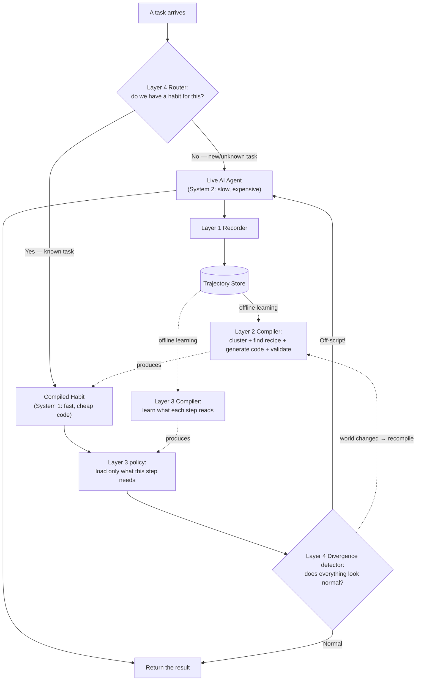

# HABIT — Harnessing Agent Behavior Into deterministic Tasks

**Muscle memory for AI agents — decide once, execute forever.**

HABIT is a self-optimizing runtime for LLM agents. It records agent runs as structured
trajectories, compiles repeated behavior into deterministic code ("habits"), induces per-step
context policies from observed access patterns, and at runtime routes tasks to habits while
detecting mid-run divergence and falling back to the live LLM agent.

## Architecture

HABIT is organized into four layers with strict boundaries:

| Layer | Package | Responsibility |
| --- | --- | --- |
| 1 — Recorder | `habit.recorder` | Wrap an agent framework, emit validated `Trajectory` objects, persist them. |
| 2 — Compiler | `habit.compiler` | Cluster trajectories, induce stable skeletons, generate deterministic habits, replay-validate them. |
| 3 — Context | `habit.context` | Induce per-step context policies from access patterns; paging and prefetch. |
| 4 — Runtime | `habit.runtime` | Route tasks to habits or the live agent, detect divergence, fall back safely, trigger recompilation on drift. |

Supporting modules: `habit.schemas` (frozen data contracts), `habit.interfaces` (cross-layer
protocols), plus adapters, workloads, and eval harnesses added in later phases.

### How a task flows



**Full architecture** — with the layer diagram, a plain-language explanation, and a worked
customer-support example — is in **[docs/ARCHITECTURE.md](docs/ARCHITECTURE.md)**.

## Status

Layer 1 (the recording foundation) is complete and fully tested. Layers 2–4 are the road ahead.

### Completed

- **Project skeleton** — `src`-layout package, hatchling build, PEP 561 typed marker.
  `pip install -e ".[dev]"` and `import habit` both work. CI runs `ruff` → `mypy` (strict) →
  `pytest` on Python 3.11.
- **Trajectory schema** (`habit.schemas`) — the frozen Pydantic v2 record of one agent run:
  `Trajectory`, `Step`, `LLMCall`, `ToolCall`, `ContextItem`, `Outcome`, and the `StepType` /
  `ContextKind` enums. Enforces step-payload invariants, tool-result fingerprint invariants,
  referential integrity across context items, and timezone-aware timestamps. Round-trips
  losslessly through JSON and dicts. Field names align to OpenTelemetry GenAI semantic
  conventions (see [docs/otel_mapping.md](docs/otel_mapping.md)).
- **Structure fingerprint** (`habit.schemas.schema_fingerprint`) — a deterministic,
  value-independent hash of a tool result's key/type structure. Stable across values, key order,
  and list length; the signal the future divergence detector (Layer 4) will compare against.
- **Storage interface** (`habit.interfaces.TrajectoryStore`) — a backend-agnostic,
  `@runtime_checkable` protocol for persisting and querying trajectories (`save`, `get`, `query`,
  `count` with AND-filter semantics).
- **Storage backend** (`habit.storage`) — a SQLAlchemy 2.x implementation of `TrajectoryStore`.
  Backend is chosen entirely by the `DATABASE_URL` environment variable (SQLite by default,
  PostgreSQL by changing that one variable, no code change). Trajectories are stored losslessly as
  a JSON payload with indexed `domain` / `outcome` / `started_at` columns.
- **Recorder** (`habit.recorder`) — the framework-agnostic flight recorder. Assembles LLM, tool,
  and other steps into a validated `Trajectory`, auto-numbers steps, normalizes timestamps to UTC,
  computes tool-result fingerprints internally, and persists via a `TrajectoryStore`.
- **LangGraph adapter** (`habit.adapters`) — records a real LangGraph/LangChain run end-to-end via
  callback handlers, and persists the resulting `Trajectory`. Tested offline with a fake model.

### In progress / not yet started

- **In progress:** synthetic workload generators (`habit.workloads`).
- **Not yet started:** the compiler (`habit.compiler`), context policies (`habit.context`), the
  runtime router and divergence detector (`habit.runtime`), and the evaluation benchmark
  (`habit.eval`).

## Development

Requires Python 3.11+.

```bash
pip install -e ".[dev]"

ruff check src tests
mypy
pytest -q
```

All tests run offline with no API key and no network access.

## Design notes

Significant decisions not dictated by a task are recorded in
[docs/decisions.md](docs/decisions.md).
