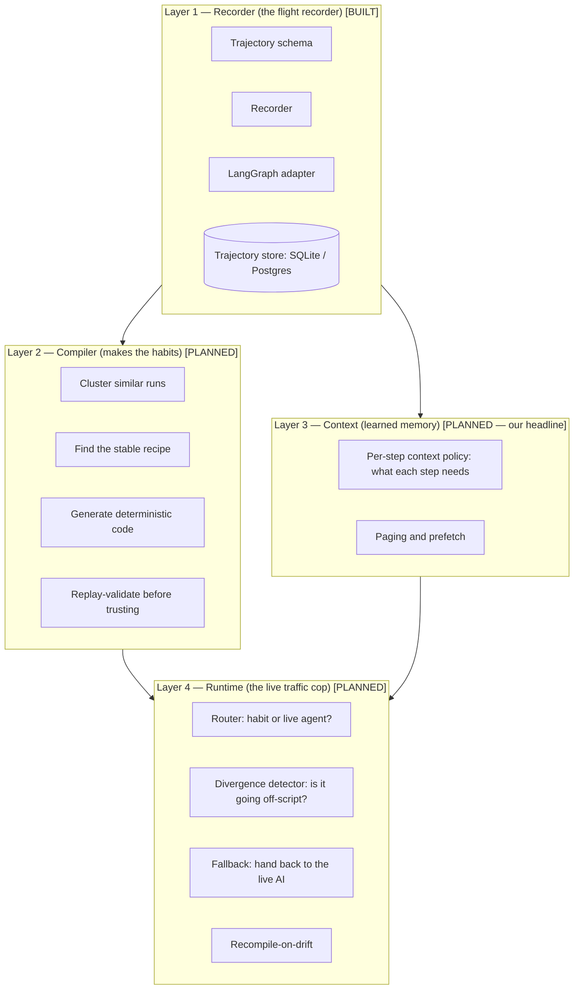
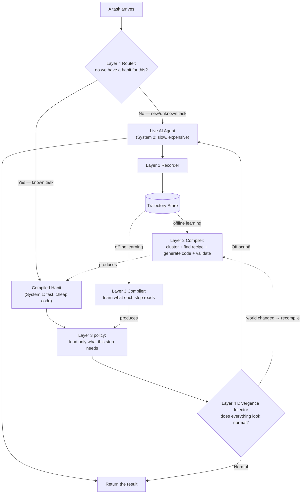

# HABIT — System Architecture

*A simple, plain-language guide to how HABIT is built. Includes a diagram and one running
example (customer-support tickets). Written so anyone can follow it.*

---

## 1. The big idea in one picture

HABIT sits **around** an existing AI agent. It watches the agent work, learns the parts that
repeat, turns those parts into cheap reliable code, and only wakes the full (expensive) AI when
something new happens.

Think of a new employee. On day one they think hard about every task and work slowly. After doing
the same task a thousand times, they stop thinking and just do it — fast, cheap, automatic. Their
brain switches back on only when something unusual appears. HABIT gives an AI agent that same
"muscle memory."

Two ways to describe it:
- **System 1 / System 2:** the compiled "habits" are System 1 (fast, cheap, automatic). The live AI
  is System 2 (slow, expensive, careful). HABIT chooses which one drives at each moment.
- **JIT compiler + virtual memory, for agents:** the repeated work gets "compiled" into cheap code;
  new work stays "interpreted" by the live AI; and memory is paged in and out like an operating
  system.

---

## 2. Architecture diagram

### 2a. The four layers (what the pieces are)

### 2b. How a task flows (the two phases)

Two phases to notice:
- **Learning phase (offline, in private):** the system runs the agent many times, stores the runs,
  and the compilers turn them into habits + memory policies. Slow, but nobody is waiting.
- **Serving phase (online, live):** a task arrives, the router picks the cheap habit if it exists,
  the divergence detector guards it, and it falls back to the live AI if anything looks wrong.

---

## 3. The four layers explained (simple words)

### Layer 1 — Recorder (the flight recorder)  ✅ BUILT
This layer watches the agent and writes down everything it does as a structured "trajectory" (a
diary of one run): the task, every step, every tool call with its inputs and outputs, what
information each step looked at, and whether it succeeded. It must be boring and reliable, because
everything else is built on top of it.
- **What exists in code today:** the trajectory schema (`habit.schemas`), the database
  (`habit.storage`, SQLite by default, Postgres by changing one setting), the recorder
  (`habit.recorder`), and the LangGraph adapter (`habit.adapters`) that plugs into a real agent.

### Layer 2 — Compiler (makes the habits)  🔜 PLANNED
Runs offline, now and then. It groups similar past runs together (clustering), finds the **stable
recipe** — the sequence of steps that is the same in almost every successful run — and writes real
computer code for that recipe. The few steps that truly change stay as tiny, cheap AI calls.
Before any habit is allowed to go live, it is **replay-validated**: re-run against many past runs to
check it still gives the correct answers. An unchecked habit is never used.

### Layer 3 — Context (learned memory)  🔜 PLANNED — *our headline contribution*
Because we recorded exactly what each step read, we know what each step actually needs. If the
"decide the category" step never once used the customer's full history, it does not need it on the
desk. Layer 3 turns these observations into **per-step memory rules**: what to keep in the AI's
working memory, what to file away, and what to fetch back just before the step that needs it. This
stops the agent from "forgetting" on long tasks and cuts cost (fewer words sent to the AI). No other
system learns memory rules from usage like this — it is the most novel part of HABIT.

### Layer 4 — Runtime (the live traffic cop)  🔜 PLANNED — *the research heart*
This is the always-on part. When a task arrives, the **router** asks: do we have a habit for this?
If yes, run the cheap habit; if no, run the full live AI (and record it, feeding Layer 1). While a
habit runs, the **divergence detector** watches every step: does the tool output have the shape we
always saw? Is everything in the normal range? The moment something looks wrong, it **falls back**
to the full live AI, which handles the situation safely. If the world has truly changed (for example
a tool changed its format), the habit is marked stale and **recompiled** from fresh runs.

---

## 4. One simple example, start to finish (customer-support tickets)

Imagine a company that gets thousands of support messages a day. A typical ticket task has these
steps:

1. Read the customer's message and decide the category (billing / technical / refund) — **needs AI thinking**.
2. Look up the customer's account in the database — **mechanical**.
3. Check the account status (for example: is the subscription active?) — **mechanical**.
4. Write a reply or send the ticket to the right team — **mostly a template; AI only for unusual cases**.

Now follow this task through the architecture:

**Learning phase (happens first, offline):**
- The live AI agent handles the first, say, 1000 tickets normally. It is slow and expensive, and at
  every step it asks the AI "what should I do next?" — even for the mechanical steps.
- **Layer 1 (Recorder)** writes each run into the **Trajectory Store**.
- **Layer 2 (Compiler)** looks at all these stored runs, sees that almost every "refund" ticket
  follows the exact same four steps, and writes a cheap code **habit** for it. It replay-validates
  the habit against past tickets to be sure it is correct.
- **Layer 3 (Context)** notices that the "decide the category" step only ever reads the message
  text — not the full 2-year account history — so it makes a memory rule: for this step, keep only
  the message; file the rest away.

**Serving phase (live, in front of real customers):**
- A new refund ticket arrives.
- **Layer 4 (Router)** recognizes it as a known "refund" task and picks the cheap **habit** instead
  of the expensive live AI.
- The habit runs the four steps as code. **Layer 3** loads only what each step needs, so memory
  never overflows and fewer words are sent to the AI.
- **Layer 4 (Divergence detector)** watches. Every step looks normal, so the ticket is handled fast
  and almost for free.
- **Now a weird ticket arrives** — a customer writes in a mix of two languages about a problem the
  company has never seen. The habit starts, but the divergence detector sees the message does not
  match the normal pattern. It **stops the habit and hands control back to the full live AI**, which
  thinks carefully and solves it. That new run is recorded, so next time the system is a little
  smarter.

**What each problem looked like, and how HABIT fixed it in this example:**
- **Cost:** the normal agent made ~4 expensive AI calls per ticket. The habit makes almost zero
  (just cheap code, plus a tiny AI call only for unusual replies). Multiplied by thousands of
  tickets a day, this is a huge saving.
- **Reliability:** the normal agent had several uncertain AI steps in a row, so tickets sometimes
  failed. The habit's steps are deterministic code — they behave the same every time — so far fewer
  tickets fail, and the divergence detector catches trouble instead of hiding it.
- **Memory (context):** the normal agent piled the whole account history onto the desk and could run
  out of room on long tickets. Layer 3 keeps only what each step needs, so it never overflows.

---

## 5. Current status (what exists in code right now)

| Layer / part | Module | Status |
|---|---|---|
| Trajectory schema + fingerprint | `habit.schemas` | ✅ Built |
| Storage (SQLite/Postgres) | `habit.storage` | ✅ Built |
| Recorder (flight recorder core) | `habit.recorder` | ✅ Built |
| LangGraph adapter | `habit.adapters` | ✅ Built |
| Workload generators (synthetic tasks) | `habit.workloads` | 🔧 In progress |
| Compiler (clusters → recipe → code → validate) | `habit.compiler` | 🔜 Planned |
| Context policies (paging, prefetch) | `habit.context` | 🔜 Planned |
| Runtime (router, divergence, fallback) | `habit.runtime` | 🔜 Planned |
| Benchmark + metrics + demo | `habit.eval` | 🔜 Planned |

**In one line:** the entire recording foundation (Layer 1) is built and tested; the learning
(Layer 2), memory (Layer 3), and live-runtime (Layer 4) layers are the road ahead.

---

## 6. The one sentence to remember

> HABIT records how an agent works, learns the parts that repeat, turns them into cheap reliable
> code that manages its own memory, and keeps a safety net that wakes the full AI only when
> something new happens.
